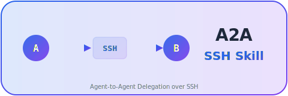

<p align="center">
  <picture>
    <source media="(prefers-color-scheme: dark)" srcset="docs/assets/a2a-ssh-logo-dark.svg">
    <source media="(prefers-color-scheme: light)" srcset="docs/assets/a2a-ssh-logo.svg">
    
  </picture>
</p>

<p align="center">
  <strong>Google A2A wants you to build an HTTP server.<br/>We just need your SSH key. 🔑</strong>
</p>

<p align="center">
  <a href="LICENSE"></a>
  
  
  
  
</p>

<p align="center">
  <b>No HTTP. No Agent Cards. No JSON-RPC. Just SSH.</b><br/>
  <sub>Inspired by <a href="https://github.com/a2aproject/A2A">Google Agent2Agent (A2A) Protocol</a> · Built for builders who need it working today</sub>
</p>

---

> **Tired of 100+ MCP tools burning tokens just to talk across machines?**
> Tired of setting up HTTP servers, Agent Cards, and JSON-RPC endpoints before your agents can even say hello?
>
> **A2A SSH Skill** is the fastest way to get [Agent2Agent (A2A)](https://github.com/a2aproject/A2A)-style remote agent execution working. One script. Zero dependencies. Your agents start working across machines in 5 minutes.

---

## What is A2A SSH Skill?

A zero-dependency Python tool for **Agent2Agent (A2A)-style delegation over SSH**. Inspired by [Google A2A](https://github.com/a2aproject/A2A), it lets Claude Code, Codex, and other CLI agents send work to remote machines — without building an HTTP server, Agent Cards, or JSON-RPC endpoints.

While others are writing protocol specs, **your agents are already getting work done.**

```bash
# That's it. One command. Your laptop agent delegates to your GPU server.
python agent.py send gpu-server \
  --cwd "/workspace/ml-project" \
  --text "Run the training pipeline and report metrics" \
  --mode write --wait
```

## Why A2A SSH Skill?

<table>
<tr><th></th><th>🔀 A2A SSH Skill</th><th>🌐 Google A2A Protocol</th></tr>
<tr><td><b>What it is</b></td><td>Cross-node delegation tool</td><td>Interoperability protocol spec</td></tr>
<tr><td><b>Setup time</b></td><td>⚡ 5 minutes</td><td>Hours (implement endpoints)</td></tr>
<tr><td><b>Dependencies</b></td><td>Python stdlib + SSH</td><td>HTTP server + JSON-RPC + SDK</td></tr>
<tr><td><b>Infrastructure</b></td><td>Your existing SSH keys</td><td>Agent Cards, HTTP endpoints, webhooks</td></tr>
<tr><td><b>Cross-machine</b></td><td>✅ Native design goal</td><td>Possible, but you build the infra</td></tr>
<tr><td><b>Task artifacts</b></td><td>✅ Built-in (reply.md, log.md, output/)</td><td>Not provided by protocol</td></tr>
<tr><td><b>Failure recovery</b></td><td>✅ Timeout, recursion guard, zombie cleanup</td><td>Up to implementer</td></tr>
<tr><td><b>Best for</b></td><td><b>Getting work done across 2-5 machines today</b></td><td>Cross-vendor agent ecosystem interop</td></tr>
</table>

> **A2A SSH Skill and Google A2A are complementary, not competing.** A2A solves agent *discovery* and *interoperability*. A2A SSH Skill solves agent *delegation* and *execution*. Use A2A to find agents. Use A2A SSH Skill to actually run the work.

## Demo

```
┌─────────────────────────────────────────────────────────────┐
│ [Laptop] You type:                                          │
│                                                             │
│ $ python agent.py send gpu-server \                         │
│     --cwd "/home/user/project" \                            │
│     --text "Run tests and fix failures" \                   │
│     --mode write --wait                                     │
│                                                             │
│ [GPU Server] Claude receives task...                        │
│   ├── Reads test files                                      │
│   ├── Runs pytest                                           │
│   ├── Fixes 3 failing tests                                 │
│   ├── Writes reply.md + log.md                              │
│   └── Results sent back via SSH                             │
│                                                             │
│ [Laptop] ✅ [OK]                                            │
│ Fixed 3 failing tests in src/utils.py:                      │
│ - test_parse_config: fixed missing default value            │
│ - test_validate_input: added boundary check                 │
│ - test_export_data: corrected file path                     │
└─────────────────────────────────────────────────────────────┘
```

**One command. The laptop agent delegates, the GPU server agent executes, results come back as structured files.**

## Quick Start

```bash
# 1. Clone
git clone https://github.com/YonganZhang/a2a-ssh-skill && cd a2a-ssh-skill

# 2. Configure your nodes (no pip install needed!)
cp agents.example.json agents.json
# Edit: set your SSH hosts, claude_path, python_path

# 3. Send your first task
python agent.py send my-server \
  --cwd "/home/user" \
  --text "What's the disk usage and memory status?" \
  --mode read --wait

# 4. That's it. No servers to start. No endpoints to deploy.
```

## Features

| | Feature | Description |
|---|---|---|
| 🪶 | **Zero Dependencies** | Python standard library only. No `pip install`. No `npm`. No SDKs. |
| 🖥️ | **Cross-Platform** | Windows, Linux, WSL, macOS. One unified Python runner. |
| ⚡ | **Fast Path** | Read-only tasks stream directly via SSH stdout — no runner overhead. |
| 🛡️ | **Battle-Tested** | Recursion guard, timeout cap (1800s), process-group kill (`setsid`), atomic writes. |
| 📄 | **Observable** | Every job produces `prompt.md`, `reply.md`, `log.md`. Human-readable. `grep`-able. `diff`-able. |
| 🔀 | **Flexible Routing** | Direct SSH, relay through intermediate node, or shared filesystem (WSL). |
| 🤖 | **AI-Agnostic** | Works with any CLI AI that accepts `-p` prompt: Claude Code, Codex, Aider, etc. |
| 🔒 | **Anti-Loop** | `AGENT_DELEGATE_DEPTH` prevents A→B→A infinite delegation loops that burn tokens. |

## Architecture

```
┌──────────────┐         SSH          ┌──────────────┐
│   Laptop     │ ──────────────────►  │  GPU Server  │
│              │                      │              │
│  agent.py    │  1. Upload job dir   │  runner.py   │
│  (dispatch)  │     (SCP)            │  (execute)   │
│              │                      │              │
│  Creates:    │  2. Launch runner    │  Runs:       │
│  prompt.md   │     (SSH)            │  Claude CLI  │
│  meta.json   │                      │  via stdin   │
│  runner.py   │  3. Fetch results    │              │
│              │ ◄──────────────────  │  Produces:   │
│  Reads:      │     (SCP)            │  reply.md    │
│  reply.md    │                      │  log.md      │
│  log.md      │                      │  output/     │
└──────────────┘                      └──────────────┘
```

### Execution Paths

| Target | Mode | Wait | Path | Speed |
|--------|------|------|------|-------|
| Linux | read | yes | **Direct SSH stdout** | ⚡ Fastest |
| Linux | write | * | Python runner | 🏃 Fast |
| Windows | * | * | Python runner | 🏃 Fast |

### Three-Node Example (Real Setup)

```
┌────────────┐    SSH     ┌────────────┐    WSL    ┌────────────┐
│  Laptop    │ ────────►  │  Windows   │ ───────►  │   Linux    │
│  (Win 11)  │            │  Server    │           │   (WSL2)   │
│  i7 + 4060 │ ◄──────── │  i9+4090   │ ◄─────── │  Ubuntu    │
│            │    SSH     │            │    FS     │  PyTorch   │
└────────────┘            └────────────┘           └────────────┘
```

## How It Works

1. **`agent.py`** creates a job directory with `prompt.md` + `meta.json` + `runner.py`
2. Uploads the job directory to the remote machine via **SCP**
3. Launches `runner.py` on the remote node via **SSH**
4. `runner.py` invokes Claude CLI with the prompt via **stdin pipe** (cross-platform safe)
5. Claude executes the task, writes `reply.md` and `log.md`
6. Results are fetched back via **SCP** (or available instantly on shared filesystem)

### Job Directory Protocol

```
jobs/<job-id>/
├── prompt.md      # Task instructions
├── meta.json      # Metadata (target, mode, timeout, paths)
├── runner.py      # Bundled runner (self-contained)
├── reply.md       # ✅ [OK] or ❌ [FAILED] + result
├── log.md         # Execution log with timestamps
├── input/         # Input files (optional)
└── output/        # Generated files (optional)
```

**Everything is a plain text file.** No database. No message queue. Debug with `cat`. Monitor with `watch`. Archive with `tar`.

## Test Results

Tested on a real three-node setup: **Windows 11 laptop ↔ Windows Server (i9-14900KF + RTX 4090) ↔ Ubuntu 24.04 WSL**

```
✅ Test 1: Linux read+wait (direct SSH stdout)         PASS
✅ Test 2: Linux write+wait (Python runner)             PASS
✅ Test 3: Timeout cap enforcement (99999 → 1800s)      PASS
✅ Test 4: Windows read+wait (Python runner)            PASS
✅ Test 5: Recursive delegation blocked                 PASS
✅ Test 6: stdout "overloaded" doesn't trigger retry    PASS
```

Run the tests yourself:
```bash
./tests/e2e-test.sh my-server
```

## Configuration

```json
{
  "agents": {
    "my-laptop": {
      "hostname_patterns": ["MY-LAPTOP-*"],
      "platform": "windows",
      "claude_path": "claude",
      "python_path": "python",
      "job_root": "C:/Users/me/exchange/jobs",
      "ssh_from": { "gpu-server": "laptop-ssh" }
    },
    "gpu-server": {
      "hostname_patterns": ["GPU-SERVER-*"],
      "platform": "linux",
      "claude_path": "/usr/local/bin/claude",
      "python_path": "python3",
      "job_root": "/home/user/exchange/jobs",
      "ssh_from": { "my-laptop": "gpu-ssh" }
    }
  }
}
```

See [agents.example.json](agents.example.json) for a fully commented template, and [examples/](examples/) for two-node and three-node setups.

## Roadmap

- [ ] 📦 Standalone CLI (`pip install a2a-ssh-skill`)
- [ ] 🤖 More AI CLI adapters (Codex, Gemini CLI, Aider, Ollama)
- [ ] 📊 Web dashboard for job monitoring
- [ ] 🌐 Optional Google A2A protocol bridge

### Design Principles

| Principle | How |
|-----------|-----|
| **Low token consumption** | Only prompt text is transmitted. No model context, no conversation history. |
| **High accuracy** | Task results delivered as files (`reply.md`), not chat-style fuzzy output. |
| **Full explainability** | Every job has complete `log.md` with execution trace, timestamps, and exit codes. |

## FAQ

<details>
<summary><b>How is this different from Google A2A?</b></summary>

Google A2A is a **protocol specification** for agent interoperability (like HTTP for agents). A2A SSH Skill is a **practical tool** that lets agents delegate work across machines right now, using SSH. Think of it as: A2A is the spec, A2A SSH Skill is the "just make it work" implementation for teams with SSH access.
</details>

<details>
<summary><b>Does it only work with Claude Code?</b></summary>

No. It works with **any CLI AI tool** that accepts a `-p` (prompt) flag and can use file-based tools (Read, Write, Bash). Claude Code, Codex, and similar tools all work. The `claude_path` in config can point to any compatible CLI.
</details>

<details>
<summary><b>Do I need cloud services?</b></summary>

No. A2A SSH Skill runs entirely over SSH between your own machines. No cloud APIs, no SaaS, no third-party services. Your prompts and results stay on your machines.
</details>

<details>
<summary><b>How is this different from just SSH-ing and running commands?</b></summary>

A2A SSH Skill adds: structured task delivery (prompt.md), result collection (reply.md), execution logging (log.md), automatic routing, timeout protection, recursion guards, and cross-platform compatibility. It's the difference between raw TCP sockets and HTTP — same transport, much better protocol.
</details>

<details>
<summary><b>Can I add more nodes?</b></summary>

Yes. Just add entries to `agents.json`. Each node auto-detects its identity via hostname matching. Supports direct SSH, relay routing (A→B→C), and shared filesystem (WSL).
</details>

## Contributing

Contributions are welcome! Please feel free to submit a Pull Request.

1. Fork the repo
2. Create your feature branch (`git checkout -b feature/amazing-feature`)
3. Commit your changes
4. Push to the branch (`git push origin feature/amazing-feature`)
5. Open a Pull Request

## License

[MIT](LICENSE) — use it however you want.

---

<p align="center">
  <b>If your agent can SSH, your agent can scale.</b>
  <br/>
  <sub>Not an official Google A2A implementation. Inspired by the Agent2Agent vision, built for builders who need it working today.</sub>
</p>
