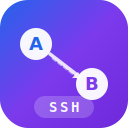

<div align="center">

  

  <h1>A2A SSH Skill</h1>

  <p>
    <strong>基于 SSH 的 AI 智能体跨机器委派工具。</strong><br/>
    <strong>零依赖。开箱即用。</strong>
  </p>

  <p>
    <a href="LICENSE"></a>
    
    
    
    
    
  </p>

  <p>
    <sub>灵感来自 <a href="https://github.com/a2aproject/A2A">Google Agent2Agent (A2A) 协议</a> · 为需要今天就用起来的开发者而生</sub>
  </p>

  <p>
    <a href="README.md"><b>English</b></a> · <a href="README_CN.md">中文</a>
  </p>

</div>

<br/>

<div align="center">

> **💬 受够了 100+ 个 MCP 工具在跨机器通信时疯狂消耗 token 了吗？**<br/>
> **Google A2A 要你搭 HTTP 服务器。我们只需要你的 SSH 密钥。🔑**

</div>

<br/>

<div align="center">
<table>
<tr>
<td align="center" width="260">
  <h3>💰 节省 ~90% Token</h3>
  <p>无框架上下文注入，无 MCP 工具开销。<br/>只有你的 prompt 在网络上传输。</p>
</td>
<td align="center" width="260">
  <h3>⚡ 5 分钟上手</h3>
  <p>克隆 → 改 JSON → 发任务。<br/>不需要搭服务器，不需要 <code>pip install</code>。</p>
</td>
<td align="center" width="260">
  <h3>🔒 零攻击面</h3>
  <p>不暴露任何 HTTP 端点。<br/>SSH 自带加密。</p>
</td>
</tr>
</table>
</div>

---

## 📖 什么是 A2A SSH Skill？

**A2A SSH Skill** 是一个零依赖的 Python 工具，实现了 [Agent2Agent (A2A)](https://github.com/a2aproject/A2A) 风格的跨机器 AI 智能体委派。

Google A2A 定义了智能体之间*应该如何*通信的协议（JSON-RPC、HTTP 端点、Agent Cards）。而 **A2A SSH Skill 让智能体*现在就能*跨机器工作** —— 只需 SSH、Python 和一个 CLI AI 工具（如 [Claude Code](https://claude.ai/claude-code) 或 [Codex](https://openai.com/codex)）。

> *别人在写协议规范 —— 你的智能体已经在干活了。*<br/>
> *别人在部署 Agent Cards 和 webhook —— 你的智能体已经把结果交回来了。*<br/>
> *别人花了一周搞互操作性 —— 你花了 5 分钟改 `agents.json`。*

---

## 🔄 为什么选 A2A SSH Skill？

A2A SSH Skill 和 Google A2A 是**互补关系，不是竞争关系**：

- **Google A2A** → *"智能体之间应该如何在互联网上发现和对话？"*
- **A2A SSH Skill** → *"怎么让我的几台机器现在就组成 AI 团队干活？"*

<table>
<tr>
  <th width="160"></th>
  <th width="300">🔀 A2A SSH Skill</th>
  <th width="300">🌐 Google A2A 协议</th>
</tr>
<tr><td><b>本质</b></td><td>开箱即用的委派工具</td><td>互操作协议规范</td></tr>
<tr><td><b>上手时间</b></td><td>⚡ 5 分钟</td><td>数小时到数天</td></tr>
<tr><td><b>依赖</b></td><td>Python 标准库 + SSH</td><td>HTTP 服务器 + JSON-RPC + SDK</td></tr>
<tr><td><b>基础设施</b></td><td>已有的 SSH 密钥</td><td>Agent Cards + HTTP 端点 + webhooks</td></tr>
<tr><td><b>传输层</b></td><td>SSH（默认加密）</td><td>HTTP/HTTPS</td></tr>
<tr><td><b>发现机制</b></td><td><code>agents.json</code> 配置文件</td><td>Agent Card 元数据标准</td></tr>
<tr><td><b>跨机器</b></td><td>✅ 原生设计目标</td><td>可以，但需要自己搭建基础设施</td></tr>
<tr><td><b>任务产物</b></td><td>✅ 内建（<code>reply.md</code>、<code>log.md</code>、<code>output/</code>）</td><td>协议层不提供</td></tr>
<tr><td><b>失败恢复</b></td><td>✅ 超时、递归防护、僵尸清理</td><td>由实现者负责</td></tr>
<tr><td><b>Token 效率</b></td><td>✅ 仅传 prompt，节省 ~90%</td><td>取决于实现</td></tr>
<tr><td><b>可解释性</b></td><td>✅ 完整 <code>log.md</code> 执行轨迹</td><td>取决于实现</td></tr>
<tr><td><b>最适合</b></td><td><b>今天就要把活干完</b></td><td>跨厂商智能体生态互通</td></tr>
</table>

> **一句话总结** —— 想让你的机器们组队干活？**A2A SSH Skill，5 分钟。** 想搭建公开的智能体市场？用 Google A2A。

---

## 🎬 演示

```
┌───────────────────────────────────────────────────────────────┐
│                                                               │
│  $ python agent.py send gpu-server \                          │
│      --cwd "/home/user/ml-project" \                          │
│      --text "跑一下失败的测试，帮我修好" \                           │
│      --mode write --wait                                      │
│                                                               │
│  ── 幕后发生了什么 ────────────────────────────────────────────  │
│                                                               │
│  1. 创建任务目录 → prompt.md + meta.json + runner.py            │
│  2. 通过 SCP 上传到 gpu-server                                  │
│  3. 通过 SSH 启动 runner.py                                     │
│  4. 远端 AI 读代码、跑测试、修 bug                                 │
│  5. 写 reply.md + log.md                                       │
│  6. 结果拉回本地                                                 │
│                                                               │
│  ✅ [OK]                                                      │
│  修复了 src/utils.py 中的 3 个失败测试：                           │
│  - test_parse_config: 补充了缺失的默认值                          │
│  - test_validate_input: 边界检查差一                              │
│  - test_export_data: 文件路径分隔符在 Linux 上不对                  │
│                                                               │
└───────────────────────────────────────────────────────────────┘
```

---

## 🚀 快速开始

**前置条件：** Python 3.10+ · SSH 连接 · 远程机器上安装了 CLI AI 工具

```bash
# 1. 克隆（不需要 pip install！）
git clone https://github.com/YonganZhang/a2a-ssh-skill && cd a2a-ssh-skill

# 2. 配置节点
cp agents.example.json agents.json    # 编辑：SSH 地址、claude_path、python_path

# 3. 发送你的第一个任务
python agent.py send my-server \
  --cwd "/home/user" \
  --text "查一下 Python 版本和磁盘使用情况" \
  --mode read --wait
```

**作为 Claude Code Skill 使用** —— 复制到 `~/.claude/skills/`，Claude 会自动发现：

```bash
cp -r a2a-ssh-skill ~/.claude/skills/agent-task-delegate
```

---

## 💡 使用场景

| | 场景 | 示例 Prompt |
|---|---|---|
| 🧪 | **远程测试** | *"在服务器上跑测试套件，把失败的修好"* |
| 🔧 | **远程调试** | *"查一下为什么 API 返回 500 错误"* |
| 🤖 | **GPU 算力调度** | *"用 GPU 服务器训练这个模型，报告指标"* |
| 📊 | **跨机器检查** | *"对比 staging 和 production 的配置"* |
| 🏗️ | **多节点部署** | *"更新服务器 A 的服务，然后从服务器 B 验证"* |
| 🐛 | **日志分析** | *"搜索 nginx 日志中的超时错误"* |
| 📦 | **构建委派** | *"在 Linux 机器上编译，那边更快"* |
| 🔍 | **安全审计** | *"检查所有开放端口和运行中的服务"* |

---

## ✨ 特性

| | 特性 | 说明 |
|---|---|---|
| 🪶 | **零依赖** | 仅用 Python 标准库。无需 `pip install`。复制即用。 |
| 🖥️ | **跨平台** | Windows · Linux · WSL · macOS。统一的 Python runner。 |
| ⚡ | **快速通道** | Linux 只读任务直接走 SSH stdout —— 零 runner 开销。 |
| 🛡️ | **实战验证** | 递归防护 · 超时上限 · 进程组 kill · 原子写入。 |
| 📄 | **全程可观测** | `prompt.md` · `reply.md` · `log.md` —— 人类可读、可 grep、可 diff。 |
| 🔀 | **灵活路由** | 直连 SSH · 中继（A→B→C）· 共享文件系统。 |
| 🤖 | **AI 工具无关** | Claude Code、Codex、Aider —— 任何支持 `-p` 参数的 CLI AI。 |
| 🔒 | **防循环** | `AGENT_DELEGATE_DEPTH` 阻止无限委派循环。 |
| 💰 | **省 Token** | 仅传输 prompt 文本。无上下文、无历史、无框架开销。 |

---

## 🏗️ 架构

```
  ┌───────────────┐                         ┌───────────────┐
  │   节点 A        │          SSH            │   节点 B        │
  │   （调度端）     │                         │   （执行端）     │
  │                │  1. 上传任务目录 (SCP)     │                │
  │   agent.py     │ ─────────────────────►  │   runner.py    │
  │                │                         │                │
  │   创建：        │  2. 启动 runner (SSH)    │   调用：        │
  │   · prompt.md  │ ─────────────────────►  │   AI CLI 工具   │
  │   · meta.json  │                         │   通过 stdin    │
  │   · runner.py  │  3. 拉取结果 (SCP)       │                │
  │                │ ◄─────────────────────  │   产出：        │
  │   接收：        │                         │   · reply.md   │
  │   · reply.md   │                         │   · log.md     │
  │   · log.md     │                         │   · output/    │
  └───────────────┘                         └───────────────┘
```

### 执行路径

| 目标 | 模式 | 等待 | 路径 | 速度 |
|:-----|:-----|:-----|:-----|:-----|
| Linux | read | 是 | **SSH 直出 stdout** | ⚡ 最快 |
| Linux | read | 否 | Python runner | 快 |
| Linux | write | * | Python runner | 快 |
| Windows | * | * | Python runner | 快 |

### 拓扑结构

A2A SSH Skill 支持**任意数量节点**、任意拓扑：

```
双节点              三节点（中继）                   扇出
                                                     ┌─► 🖥️ 服务器 A
💻 ── SSH ──► 🖥️    💻 ── SSH ──► 🖥️ ── WSL ──► 🐧    💻 ──┼─► 🖥️ 服务器 B
                                                     └─► 🐧 GPU 机器
```

只需在 `agents.json` 中添加节点。每个节点通过主机名自动识别身份。任何节点都可以是发送方、接收方，或两者兼具。

---

## ⚙️ 工作原理

### 任务协议

每次委派会创建一个**自包含的任务目录**：

```
jobs/<任务ID>/
├── prompt.md      📝 任务指令
├── meta.json      ⚙️ 元数据（目标、模式、超时）
├── runner.py      🏃 打包的执行器
├── reply.md       ✅ 结果：[OK] 或 [FAILED]
├── log.md         📋 执行轨迹
├── input/         📁 输入文件（可选）
└── output/        📁 生成的文件（可选）
```

**所有文件都是纯文本。** 用 `cat` 调试。用 `watch` 监控。用 `tar` 归档。用 `grep` 搜索。

### 执行流程

```
你输入一条命令
  └─► agent.py 检测当前节点，创建任务目录
        └─► SCP 上传到远程机器
              └─► SSH 启动 runner.py
                    └─► runner.py 通过 stdin 将 prompt 传给 AI
                          └─► AI 执行任务，写 reply.md + log.md
                                └─► agent.py 通过 SCP 拉回结果
                                      └─► 你看到结果
```

### 安全机制

| 机制 | 防止什么 |
|:-----|:---------|
| `AGENT_DELEGATE_DEPTH` | A→B→A 无限循环（烧 token） |
| `MAX_TIMEOUT_SEC = 1800` | 失控的进程 |
| `os.setsid` + `os.killpg` | SSH 断开后的僵尸进程 |
| 原子文件写入 | 读到写了一半的结果 |
| 预检检查 | 在异常的远程状态上启动任务 |
| D-state 监控 | 卡死的 WSL 实例 |

---

## 💰 Token 效率：节省 ~90%

| 浪费来源 | 传统方案 | A2A SSH Skill |
|:---------|:--------|:--------------|
| 框架上下文注入 | 每次调用 ~2000-5000 token | **0**（无框架） |
| MCP 工具定义 | ~3000-8000 token | **0**（远程使用原生工具） |
| 误重试 | 重发整个上下文 | 仅匹配 stderr |
| 委派循环 | 无限烧 token | 首次递归即阻断 |
| 发现协议 | Agent Cards 交换 | **0**（本地 `agents.json`） |

**具体例子** —— 检查远程服务器磁盘使用情况：

| 方案 | Token 消耗 |
|:-----|:----------|
| MCP 工具（工具定义 + prompt） | ~5,500 |
| **A2A SSH Skill**（仅 prompt） | **~500** |
| **节省** | **~90%** |

---

## 🧪 端到端测试结果

<table>
<tr><td>✅</td><td><b>测试 1：Linux 只读 + 等待</b></td><td>SSH 直出 stdout 路径 —— 最快、最常用的操作。验证响应正确流式返回，无 runner 开销。</td></tr>
<tr><td>✅</td><td><b>测试 2：Linux 写入 + 等待</b></td><td>完整 runner 流水线 —— SCP 上传、远程启动、AI 以写权限执行、创建 reply.md、拉回结果。</td></tr>
<tr><td>✅</td><td><b>测试 3：超时上限</b></td><td>传入 <code>--timeout-sec 99999</code>，验证被静默限制到 1800s。防止失控进程连续消耗 token 数小时。</td></tr>
<tr><td>✅</td><td><b>测试 4：Windows 只读 + 等待</b></td><td>跨平台验证 —— Python runner 在 Windows 上通过 stdin pipe 执行。证明统一 runner 正确处理 Windows 进程管理。</td></tr>
<tr><td>✅</td><td><b>测试 5：递归委派阻断</b></td><td>要求被委派的 AI 再次委派任务给其他节点，验证它拒绝 —— 防止 A→B→A 无限循环烧 token。</td></tr>
<tr><td>✅</td><td><b>测试 6：无误重试</b></td><td>输出中包含 "overloaded" 一词不触发重试。仅 stderr 错误才触发。避免在正常输出上浪费 token。</td></tr>
</table>

**测试环境：** Windows 笔记本 ↔ Windows 服务器 ↔ Ubuntu Linux —— 但 A2A SSH Skill 支持**任意操作系统组合**。

```bash
# 自己跑测试
./tests/e2e-test.sh my-server
```

---

## 📝 配置

```json
{
  "agents": {
    "my-laptop": {
      "hostname_patterns": ["MY-LAPTOP-*"],
      "platform": "windows",
      "claude_path": "claude",
      "python_path": "python",
      "job_root": "C:/Users/me/exchange/jobs",
      "ssh_from": { "gpu-server": "laptop-ssh" }
    },
    "gpu-server": {
      "hostname_patterns": ["GPU-*"],
      "platform": "linux",
      "claude_path": "/usr/local/bin/claude",
      "python_path": "python3",
      "job_root": "/home/user/exchange/jobs",
      "ssh_from": { "my-laptop": "gpu-ssh" }
    }
  }
}
```

<details>
<summary><b>📋 字段详细说明</b></summary>
<br/>

| 字段 | 必填 | 说明 |
|:-----|:-----|:-----|
| `hostname_patterns` | 是 | 主机名匹配模式，用于自动识别节点 |
| `platform` | 是 | `"windows"` 或 `"linux"` |
| `claude_path` | 是 | AI CLI 工具的可执行文件路径 |
| `python_path` | 是 | Python 解释器路径 |
| `job_root` | 是 | 任务目录存放位置 |
| `ssh_from` | 是 | `{来源节点: SSH别名}` 映射。`null` 表示同一台机器 |
| `exchange_root` | 否 | 交换文件系统根目录 |
| `relay_via` | 否 | 备用中继节点 |
| `wsl_distro` | 否 | WSL 发行版名称 |
| `capabilities` | 否 | 节点能力标签 |

</details>

详见 [agents.example.json](agents.example.json) 注释模板 · [examples/](examples/) 现成配置示例。

---

## 📌 命令

```bash
# 委派任务
python agent.py send <目标> --cwd <路径> --text "任务描述" --mode read|write [--wait] [--timeout-sec N]

# 查看状态
python agent.py status <任务ID> [--detail]

# 清理旧任务
python agent.py cleanup [--days 7]
```

---

## 🗺️ 路线图

| 状态 | 特性 |
|:----:|:-----|
| 📦 | **独立 CLI** — `pip install a2a-ssh-skill` |
| 🤖 | **更多 AI 适配** — Codex、Gemini CLI、Aider、Ollama |
| 📊 | **Web 仪表盘** — 实时任务监控 |
| 🌐 | **A2A 桥接** — 可选的 Google A2A 兼容层 |
| 🔄 | **任务链** — 自动多步工作流（A→B→C） |
| 📱 | **通知** — Slack/Telegram 完成通知 |

### 设计原则

| | 原则 | 如何实现 |
|---|---|---|
| 💰 | **低 Token 消耗** | 仅传输 prompt —— 无上下文、无历史 |
| 🎯 | **高准确度** | 文件交付结果（`reply.md`），而非聊天式模糊输出 |
| 🔍 | **全程可解释** | 完整 `log.md` 含时间戳和退出码 |
| 🪶 | **零膨胀** | 今天没有依赖，明天也不会有。 |

---

## ❓ 常见问题

<details>
<summary><b>💡 和 Google A2A 是什么关系？</b></summary>
<br/>
Google A2A 是<b>协议规范</b>（类似智能体之间的 HTTP）。A2A SSH Skill 是<b>实用工具</b>，现在就能用 SSH 工作。两者互补 —— A2A 负责发现，A2A SSH Skill 负责执行。
</details>

<details>
<summary><b>🤖 只支持 Claude 吗？</b></summary>
<br/>
不是。任何支持 <code>-p</code> 参数的 CLI AI 都行：Claude Code、Codex、Aider 等。在配置中设置 <code>claude_path</code> 即可。
</details>

<details>
<summary><b>☁️ 需要云服务吗？</b></summary>
<br/>
不需要。所有通信走 SSH，在你自己的机器之间完成。Prompt 和结果留在你的硬件上。
</details>

<details>
<summary><b>🔄 比直接 SSH 好在哪？</b></summary>
<br/>
A2A SSH Skill 增加了：结构化任务交付、结果收集、执行日志、自动路由、超时保护、递归防护、跨平台兼容。同样的传输层，更好的协议。
</details>

<details>
<summary><b>➕ 能加多少个节点？</b></summary>
<br/>
没有限制。往 <code>agents.json</code> 加就行。支持直连 SSH、中继路由（A→B→C）、共享文件系统，Windows/Linux/macOS 任意组合。
</details>

<details>
<summary><b>🔒 安全吗？</b></summary>
<br/>
安全 —— 继承 SSH 的加密机制。不暴露 HTTP 端点，不需要开额外端口。<code>--dangerously-skip-permissions</code> 是 AI 非交互执行的架构必要条件，不是安全绕过。
</details>

---

## 🤝 贡献

欢迎贡献！Bug 报告、功能建议、文档完善、代码贡献都可以。

1. Fork → 2. 创建分支 → 3. 提交 → 4. Push → 5. 发 PR

---

## 📄 许可证

[MIT](LICENSE) —— 随便用。

---

<div align="center">
  <br/>
  <b>你的智能体能 SSH，就能规模化。🚀</b>
  <br/><br/>
  <sub>
    非 Google A2A 官方实现。<br/>
    灵感来自 <a href="https://github.com/a2aproject/A2A">Agent2Agent</a> 愿景，为需要今天就用起来的开发者而生。
  </sub>
  <br/><br/>
  <a href="https://github.com/YonganZhang/a2a-ssh-skill">⭐ 点个 Star</a>，如果它帮你省下了搭 HTTP 服务器的时间。
</div>
